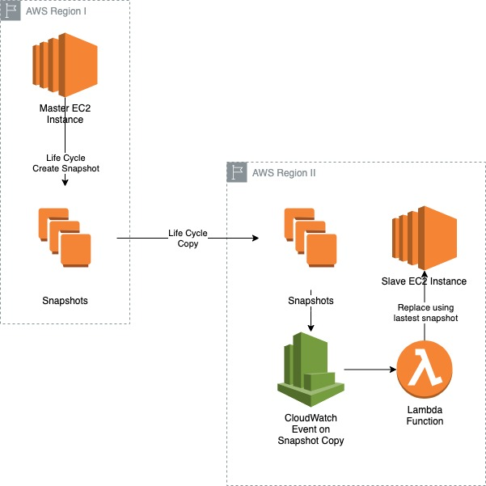

# EC2 Disaster Recovery

## Overview

* A Windows Server EC2 instance is always-on Web Server: master instance
* An existing life cycle management policy is in place creating snapshots from a running ec2 instance
* The same policy copies the snapshots to another AWS region
* In another AWS region a slave EC2 instance is created from the master instance snapshot
* This repository is responsible for triggering a CloudWatch event when the snapshot copy between regions is complete
* The CloudWatch event will trigger AWS Lambda function
* Lambda function will launch a new EC2 instance from the latest copied snapshot
* The Lambda function will then terminate the previously provisioned slave EC2 instance identified by a tag

## Out-of-scope

* Creating a life cycle management policy
* Configuring EC2 master instance as a Web Server

## In-scope

* Configure CloudWatch event using a bash script and aws-cli
* Develop a Lambda function triggered by CloudWatch event
* Deploy AWS lambda function and required artifacts using a bash script  and aws-cli
* Launch a dummy master Windows Server EC2 instance with a `C:\hello-world.txt` file
* Manually create a snapshot and copy to another region
* Demonstrate that a new instance has been created in another region to replace an existing slave instance
* Login to re-provisioned EC2 slave instance to confirm that `C:\hello-world.txt` content matches the master instance

## Acceptance Criteria

* Function can use python or node.js
* Nothing is hard-coded in the function code use environment variables instead
* Function should write its errors to CloudWatch events for troubleshooting purpose